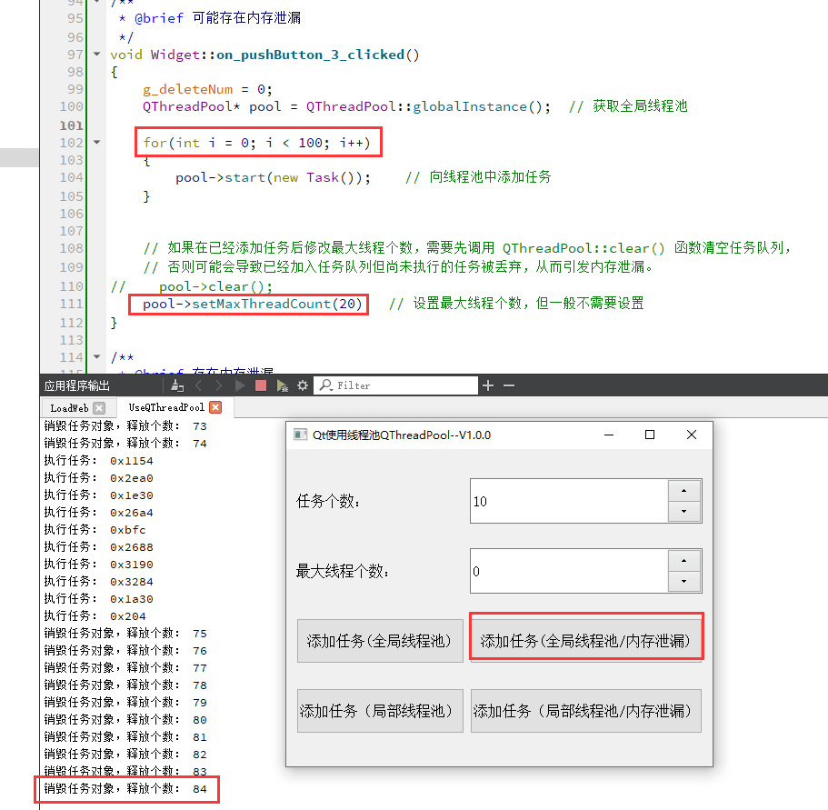
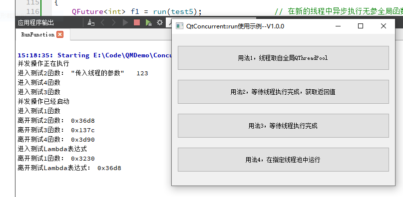
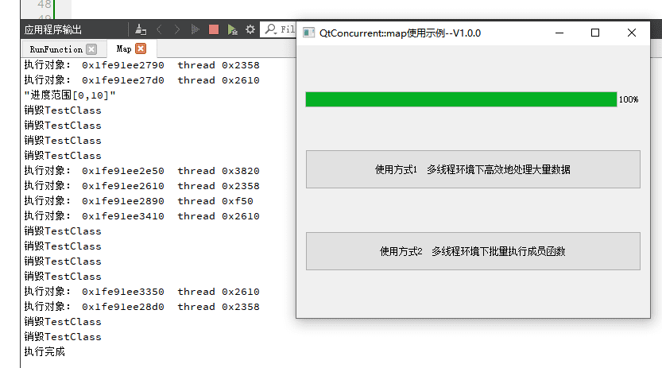
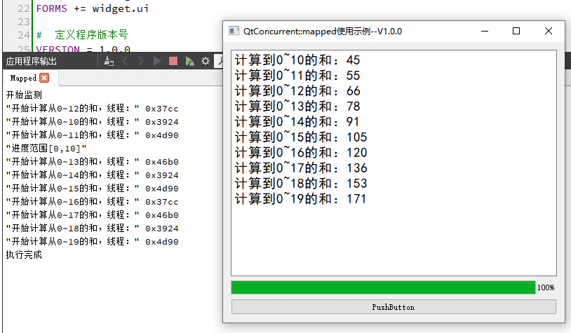

# Qt线程和并发编程示例

[toc]

---

## 1、说明

|      类名      | 功能                                                         |
| :------------: | ------------------------------------------------------------ |
|  UseQThread1   | Qt通过【实例化】QThread，使用moveToThread将QObject子类槽函数在子线程中执行 |
|  UseQThread2   | Qt通过子类化，继承QThread，重写run实现子线程                 |
| UseQThreadPool | Qt使用线程池QThreadPool示例                                  |
|  RunFunction   | QtConcurent::run使用示例，在另一个线程中运行一个函数。       |
|      Map       | QtConcurrent::map使用示例，可以在多线程环境下高效地处理大量数据， 并且可以返回一个QFuture对象，可以使用它来跟踪数据处理的进度。 |
|     Mapped     | QtConcurrent::mapped使用示例，与 map（） 类似， 不同之处在于它返回了一个包含返回值的新容器。 |

 

## 2、相关博客

|                           相关博客                           |
| :----------------------------------------------------------: |
| 👉[CSDN]()👈 |

## 3、实现效果

### 1.1 UseQThread1

> 1. Qt通过实例化QThread，使用moveToThread将QObject子类槽函数在子线程中执行；
> 1. 分别实现了将线程封装在类内部的和在类外部指定线程两种方式；
> 1. 演示了正确创建线程和退出线程的方式   ，避免出现僵尸线程或者卡死情况。                

### 2、UseQThread2

> 1. Qt通过子类化，继承QThread，重写run实现子线程；
> 2. 演示了线程的简单使用和正确退出的方式。

### 1.3 UseQThreadPool

> 1. QT使用QThreadPool、QRunnable的简单示例程序；
> 2. 演示了使用全局线程池和局部线程池；               
> 3. 演示了在添加任务后修改最大线程个人导致的内存泄漏问题和解决办法。

* 正常使用线程池

  

* 修改最大线程个数导致内存泄漏

  

### 1.5 RunFunction

> QtConcurent::run使用示例，在另一个线程中运行一个函数。

### 1.6 Map

> 1. 使用QtConcurrent::map()在多线程环境下高效地处理大量数据;
> 2. 使用QtConcurrent::map()在多线程环境下批量执行成员函数。

### 1.7 Mapped

> QtConcurrent::mapped使用示例，与 map（） 类似，不同之处在于它返回了一个包含返回值的新容器。
>
> 在mapped中异步计算多个0~n的数的和，并通过返回值传递出来。

